<!--
╔══════════════════════════════════════════════════════════════╗
║                                                              ║
║   Hey — if you're reading the raw README,                    ║
║   you're exactly the kind of developer I want to meet.       ║
║   Let's build something together.  — Meghana                 ║
║                                                              ║
╚══════════════════════════════════════════════════════════════╝
-->

<div align="center">



[](https://git.io/typing-svg)

<br/>

&nbsp;
&nbsp;
&nbsp;


</div>

<br/>

---

<br/>

<table>
<tr>
<td width="52%" valign="top">

### `~ $ cat meghana.yaml`

```yaml
name: "Meghana N"
based_in: "Mangalore, India 🇮🇳"
current_role: "Full Stack Developer"
college: "Mangalore Institute of Technology & Engineering"
branch: "Information Science Engineering"
batch: "MITE '27"

obsessions:
  - Full Stack Web Development
  - AI-powered Applications
  - Building real things for real users
  - Clean UI + Scalable Backend

currently_building:
  - ResuScan AI (live → resuscan-ai-bymeghana.vercel.app)
  - AI Video Course Generator

superpower: >
  Taking an idea from zero to a
  live, working product people can use.

life_stack: ["React", "Next.js", "Python", "curiosity", "tea☕"]
status: always_learning && always_shipping
```

</td>
<td width="48%" valign="top" align="center">

<br/>
<br/>
<br/>
<br/>


<br/><br/>


</td>
</tr>
</table>

<br/>

---

<br/>

<div align="center">

## ◈ &nbsp; Tech Arsenal

<br/>

<table align="center">
<tr>
<td align="center" width="130">

**Languages**

</td>
<td>

&nbsp;
&nbsp;
&nbsp;
&nbsp;


</td>
</tr>
<tr>
<td align="center">

**Frontend**

</td>
<td>

&nbsp;
&nbsp;
&nbsp;
&nbsp;


</td>
</tr>
<tr>
<td align="center">

**Backend & DB**

</td>
<td>

&nbsp;
&nbsp;
&nbsp;


</td>
</tr>
<tr>
<td align="center">

**AI / Tooling**

</td>
<td>

&nbsp;
&nbsp;


</td>
</tr>
<tr>
<td align="center">

**DevOps & Tools**

</td>
<td>

&nbsp;
&nbsp;
&nbsp;


</td>
</tr>
</table>

</div>

<br/>

---

<br/>

<details>
<summary><b>🚀 &nbsp; Projects Breakdown — click to expand</b></summary>

<br/>

<div align="center">

| Project | What it does | Tech |
| :--- | :--- | :--- |
| 🩺 **[ResuScan AI](https://resuscan-ai-bymeghana.vercel.app)** | AI resume analyser with ATS scoring & smart feedback | React · Vite · Puter.js · Zustand |
| 🎬 **[AI Video Course Generator](https://github.com/Meghanan-21/ai-video-course-generator)** | Converts any topic into a structured video course | TypeScript · Next.js |
| 📝 **[BlogVerse](https://github.com/Meghanan-21/blogverse)** | Full-stack blogging platform | JavaScript |
| 🏥 **[Help2Heal](https://github.com/Meghanan-21/Help2Heal)** | Healthcare app for booking & managing appointments | JavaScript |
| ☕ **[JAVA Games](https://github.com/Meghanan-21/JAVA_GAMES)** | Classic games built in Java | Java |
| 🔢 **[Simple Calculator](https://github.com/Meghanan-21/simple-calculator)** | Where every dev story begins | HTML |

</div>

<br/>

</details>

<details>
<summary><b>🏗️ &nbsp; How I Build Full Stack Apps — click to expand</b></summary>

<br/>

```
  ┌────────────────────────────────────────────────────────────┐
  │  UI Layer       →  React / Next.js + Tailwind CSS          │
  │  State Mgmt     →  Zustand / React Context                 │
  │  Backend / API  →  Node.js + Express + REST patterns       │
  │  Data Layer     →  MongoDB / MySQL + schema-first design   │
  │  AI Layer       →  Puter.js / AI APIs integrated in UI     │
  │  Deployment     →  Vercel + Docker + GitHub                │
  └────────────────────────────────────────────────────────────┘
```

<br/>

</details>

<details>
<summary><b>📊 &nbsp; Languages by Commit — click to expand</b></summary>

<br/>

<div align="center">


</div>

<br/>

</details>

<br/>

---

<br/>

<div align="center">

## ◈ &nbsp; Contribution Timeline

<br/>


</div>

<br/>

---

<br/>

<div align="center">

## ◈ &nbsp; GitHub at a Glance

<br/>


<br/><br/>


&nbsp;

&nbsp;


</div>

<br/>

---

<br/>

<div align="center">

## ◈ &nbsp; Contribution Snake


<br/>

<sub>This is just for fun and doesnt replicate my own contributions</sub>

</div>

<br/>

---

<br/>

<div align="center">

## ◈ &nbsp; What I Believe About Building

<br/>

> _"Ship something real. Then make it better."_

<br/>

<table>
<tr><td align="center" width="36"><b>01</b></td><td>Build things users can actually open in a browser — not just local demos</td></tr>
<tr><td align="center"><b>02</b></td><td>Clean UI is not decoration — it's respect for the person using your product</td></tr>
<tr><td align="center"><b>03</b></td><td>Start simple. A calculator taught me more than a tutorial ever did</td></tr>
<tr><td align="center"><b>04</b></td><td>AI is a tool, not the product — the product is what it helps someone do</td></tr>
<tr><td align="center"><b>05</b></td><td>Keep shipping. One commit at a time adds up faster than you think</td></tr>
</table>

</div>

<br/>

---

<br/>

<div align="center">

## ◈ &nbsp; Find Me

<br/>

[](https://meghana-n-portfolio.vercel.app)&nbsp;
[](https://www.linkedin.com/in/meghana-n-3b6539331/)&nbsp;
[](https://github.com/Meghanan-21)&nbsp;
[](https://resuscan-ai-bymeghana.vercel.app)&nbsp;
[](https://mite.ac.in)

<br/><br/>


<br/><br/>


<sub><code>meghana@dev:~$</code>&nbsp;</sub>

</div>
